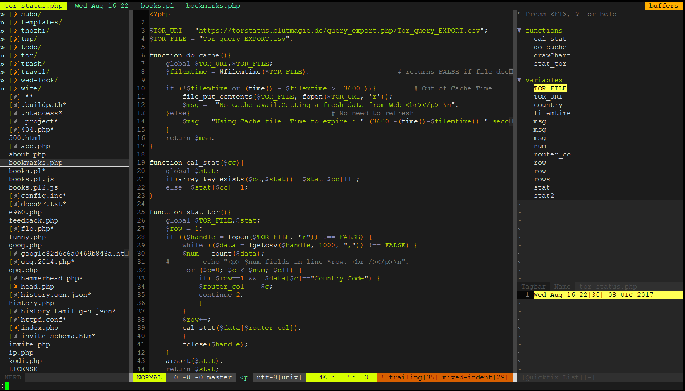

# /home/kesavan/.vim/vimrc



This Vim configuration is meant to make Vim feel more like an IDE than a simple console-based text editor.
I love this configuration at my work & home

## Installation

### Clone with GIT

Run these commands to get this Vim configuration working on your GNU/Linux machine.
You can run `git pull` inside of `~/.vim` if you'd ever like to grab the latest version.
```bash
mkdir -p ~/my-old-vim-stuff/bkup.`date +%Y%m%d`; mv ~/.vim* ~/my-old-vim-stuff/bkup.`date +%Y%m%d`  #1 backing up your old vim
git clone git://github.com/kesavanm/VIM-my-PHP-IDE.git ~/.vim                                       #2 clone & install
ln -s ~/.vim/vimrc ~/.vimrc                                                                         #3 needed for some VIM version
```

### Post Install Recommendations
* Install `dejavu-fonts-ttf` and make it as default font, if you're using SSH clients `PuTTY` or it's forked version
* MobaXterm will gives you better rendering
* Create CTAG file and update in the .vimrc ( `set tags=/home/kmuthuvel/src/tags` ) Refer in the C-TAG section below

### One Time Download

This method might be more sane. Simply downlaod the latest version, extract to `~/.vim`, and configure to your liking.
```bash
wget https://github.com/kesavanm/VIM-my-PHP-IDE/archive/master.zip
```

## Features

* Edit many files at the same time
* File Browser on left side of screen
* Move between files in center screen
* View status of the current GIT repo, if applicable
* Additional features when running under MacVIM
* Quickly navigate to files using a fuzzy finder

### Leader Key

As of `v0.2.0`, the Leader key is now bound to `Space` (used to be `Comma`)

### Switching between files (Buffers)

* `Ctrl h` `Ctrl l` to move between open files
* `<Leader>q` to close the current file (a different file will appear in its pane/window)

* `:buffers` or `:ls` -  lists open buffers
* `:b<number>`  -  open the specified buffer in the current pane.

* `:e ~/path/to/file` - Opens the file as a buffer.
* `:sp ~/path/to/file` - Opens the file in a new (Window) view port.
* `:Bclose` - Close the particular buffer. `:q` should be avoided unless need.
* `:tabe ~/path/to/file` - Opens for edit in a tab. Use `:tabclose` once done.
* `:Sex ~` or `:Sexplore` -	Opens a quick (split) explorer of the argument (Home dir ~ , in this case)
* `:Tex & :Vex`		- Native vim options beside `:Sex` (`V`ertical & `T`abbed mode)

### Tabs

* `:tabnew` - New tab to start with
* `:tab sp` - Convert the current buffer into Tab
* `:sball` - All buffers into splitted . I don't recommend this :(
* `:tab sball` - If you accidently made the above command & locked in splitted mode :)
* `:tab ball` -  All buffers into Tabs
* `:tabo`	- All tabs into buffers
* `gt` & `gT` - Switch tabs back and forth
* `F6`	- Toggle command to convert all opened files between buffers & tabs

### Viewports (Windows/Splits)

* `<Leader>h` `<Leader>j` `<Leader>k` `<Leader>l` to navigate between viewports(panes)
* `Ctrl-W` `h/j/k/l` - Port direction will allow you to move among the panes.
* `Ctrl-w w` to switch between windows
* `Ctrl-w s` - Horizontal split for current buffer(s).
* `Ctrl-w v` - Vertical split.
* `Ctrl-w c` - Close the buffer/window/tab  - Native command
* `<Leader>q` to close the current file (you probably won't ever need to do this)
* `<Leader>n` to toggle the file browser

### File Browser (NERDTree)

* Use `<Leader>n` to toggle the file browser
* Use standard movement keys to move around
* Use `Ctrl j` and `Ctrl k` to move between siblings (aka skip over children in expanded folders)
* Use `C` to make the highlighted node the current working directory

* Use `<Leader>n` to toggle the file browser
* Use standard movement keys to move around
* Use `Ctrl j` and `Ctrl k` to move between siblings (aka skip over children in expanded folders)
* Use `C` to make the highlighted node the current working directory
* Use `:Bookmark BookmarkName` to bookmark the current selection
* Use `B` to toggle the bookmark menu
* Use `?` if you'd like some NERDTree documentation
* Use `o` to open the selected file in a new buffer
* Use `t` to open the selected file in a new tab

* Use `I (shift + i)`   to list hidden files.
* Use `s` to vsplit the current window and open the selected file.
* Use `i` to split the current window and open the selected file.
* Use `t` to open file in new tab.
* Use `m` to modify the file/directory to rename, move, delete or create a file/directory.
* Use `shift + c` to move into the selected directory.
* Use `u` to move back one level in the directory tree.
* Use `x` to close the opened directory tree in which you’re in.
* Use `return` to open a directory or file.
* Use `j and k or the cursor keys` to move up and down in the list.

### Themes (ColorSchemes)

There is a very large collection of colorschemes in this repository.
Many of them can be seen [here](http://vimcolors.com/).
* `:colorscheme` or `:color <theme-name>`  - Theme at buffer
* `<Leader>x` or `F8` - Random buffer theme
* `:AirlineTheme <theme-name>` Theme at VI level

### Ctrl-P FizzyFinder
* `Ctrl-p` to perform a recursive fuzzy filename search
* `Ctrl-d`		to switch modes [To Dir search]
* `Ctrl-f/b/m`	to switch between files/buffers/MUF (Most Used Files)

### C-Tags

* Install CTAG
```bash
$ wget https://downloads.sourceforge.net/project/ctags/ctags/5.8/ctags-5.8.tar.gz
$ tar zxf ctags-5.8.tar.gz
$ cd ctags-5.8
$ ./configure --prefix=$HOME
$ make && make install
```

* Generate the tags file to hold all your project info
```bash
ctags -R --languages=php .	# you can ignore languages option as well
```

* `g Ctrl-]`aka `:tag` - is very useful. It opens a quick dialog to select one between multiple definitions.
* `ctrl-t`   - goes to previous spot where you called :tag
* `ctrl-]`   - calls `:tag` on the word under the cursor

* `:tag / <pattern>`
* `:stag / <pattern>`
* `:ptag / <pattern>`
* `:tselect / <pattern>`
* `:tjump / <pattern>`
* `:ptselect / <pattern>`
* `:ptjump / <pattern>`

* `:tag TAB`            - list the known tags
* `:tag function_name`  - jump to that function
* `:ptag`    - open tag in preview window (also ctrl-w })
* `:pclose`  - close preview window

### Search for a pattern

* `:vimgrep pattern **/*php ~/path/to/project` - Native vimgrep. Searching `php` files under `~/path/to/project`. `**` stands for recursively from the current directory. Also `:grep` and more avail.
* `:vim` - Alias for `:vimgrep`
* `F3` - Start searching
* `:Rgrep` `:Grep` - recursive grep and grep . More at http://www.vim.org/scripts/script.php?script_id=311

The following help you to filter over search results.

* `<Leader>g` - input pattern to do further filtering
* `<Leader>v` - input pattern to do further inverted filtering (like grep -v)
* `<Leader>r` - restore the Quickfix/location-list with original entries


### Quick Fix window
* Use backtick  (\`) -   Toggle between Quicklist window
* `:copen`  - Opens quick fix window
* `:cclose`	- Closes the quick fix window
* `:Run <command>` 	- Run the command and send the output to Quick fix window

### Text Navigation

Other than the myriad of built-in methods for navigating text...

* Use `<Leader><Leader>b` to highlight and jump to previous words
* Use `<Leader><Leader>w` to highlight and jump to following words

### Copying and Pasting between OS

* Use `<Leader>c` to copy the highlighted text into the OS clipboard
* Use `<Leader>v` to paste the OS clipboard into the document

### General

* `:se`  - shortcut for `:set`
* `:set mouse=a`  - set vim in mouse mode ; No right click , quick paste
* `:set mouse=`	- set vim in quick edit mode
`F4` - Alias for the mouse mode - toggle

`F5` - Alias for the `:Run` `:R` - Execute a system command and send the outcome to QuickFix window
`F7` - Show current date/time

* `gg` Goto line #1
* `G`  Goto EOF
* `N|` Goto column N
* `\*` or `\#` to jump around between files and variables.

* `Ctrl f` – Jump forward one full screen.
* `Ctrl b` – Jump backwards one full screen
* `Ctrl d` – Jump forward (down) a half screen
* `Ctrl u` – Jump back (up) one half screen

### Action over all Buffers

`bufdo! %s/pattern/replace/ge`  - Subsuiting the replace with pattern on all buffers

### Closing Windows/Tabs/VIM

* `:Bclose` `:Bc` - Buffer close , emptying buffer
* `:bd` 	- Buffer delete
* `:tabclose`	- Tab close
* `:wa` - Write all
* `:qa` `:qall` - Quit all
* `<Leader>q` to close the current file (a different file will appear in its pane/window) (you probably won't ever need to do this)

### Key Shortcuts - Quick Referenece

|Key|Action|Notes|
|---|------|-----|
|F1 | VIM - Help       | VIM Online Help for your installed version
|F2 |PASTE setting     | Toggle PASTE setting in NORMAL Mode (`set :paste`)
|F3	|Find pattern      | Search for a pattern string inside your project files
|F4	|Mouse mode toggle | Toggle between Mouse mode On and Off (`:set mouse=a`)
|F5	|Run command       | Execute an external command and populate the outcome in QuickFix window (`:Run`)
|F6  |Tab Buffer Switch | Toggle command to convert all opend files between buffers & tabs
|F7  |Current Date/Time | Show current date/time on Status
|F8  |Theme changer     | Reload a new Theme
|F9  |Function explorer | Open Class/Method/Function/Variable definitions in Right side pane
|` | QuickFix Toggle  | Toggle on QuickFix window

### Commands for Quick Referenece
|Command | Shortcut | Action| Category|  Notes|
|--------|----------|-------|---------|-------|
|`:open ~/foo.txt`or<br> `:edit ~/foo.txt` | `:o ~/foo.txt`or<br> `:e ~/foo.txt`| File open |File Operation | Opens file for edit in a new buffer
|`:write` | `:w `| File write |File Operation | Writes buffer/tab content into file
|`:<command>!` |  |Force it | File Operation|  Do it by force. Ex. `:w!` Write into file by force
|`:vsplit ~/bar.sh`|`:vsp ~/bar.sh` |  File edit |File Operation | Opens file for edit in (new) splited window (Vertical)
|`<space>`+n| | NERDTree | File Explorer | Toggles on NERDTree explorer on/off
||`I`| NERDTree|File Explorer	|list hidden files
||`u`| NERDTree | File Explorer | Move one level up
|`<space>+h/j/k/l`| `CTRL+w w`| Switch Window | Window Mgmt* | Switch to window (Left/Down/Up/Right).
|`:copen` & `:cclose` | `` ` |Open/Close QuickFix | Window Mgmt |Opens/Closes QuickFix window
|`:bdelete` |`:bd`   |Buffer Delete | Window Mgmt* | Deletes current buffer ; Closes window if need.
|`:quitall`  |`:qa`|Quit All | Window Mgmt* | Quit (Exits) all window. Bye-Bye !!!
|`:tag` or `:ptag`|`CTRL+]`|Goto definition|CTAG|Takes to exact definition. Useful to find the Method/Function/Class origin
||`g+CTRL+]`|Search definitions|CTAG | Where are this Method/Function/Class used in project files?
||`CTRL+t`|Back to usage | CTAG |Back to original file Method/Function/Class
|`CTRL+x` `CTRL+o`|| Init OMNI Search| Search | VIM Native auto-complete feature
|`:GrepBuffer <pattern>`|| Search pattern from buffers| Search | Populate in QuickFix

### Commands for Full Referenece
|Command(Original)&nbsp; | Shortcut(Alternative) | Action| Category/Operation |  Notes|
|--------|----------|-------|---------|-------|
|`~:open ~/foo.txt`or<br> `:edit ~/foo.txt` | `:o ~/foo.txt`or<br> `:e ~/foo.txt`| File open |File Operation | Opens file for edit in a new buffer
|`:view foo.bar` | | File view |File Operation | View file (read-only) in a new buffer
|`:write` | `:w `| File write |File Operation | Writes buffer/tab content into file
|`:write ~/bar.sh` | `:w ~/bar.sh`| File write |File Operation | Writes buffer/tab content into new file
|`:<command>!` |  |Force it | File Operation|  Do it by force. Ex. `:w!` Write into file by force
|`:split ~/bar.sh`|`:sp ~/bar.sh` |  File edit |File Operation | Opens file for edit in (new) splited window (Horizontal)
|`:vsplit ~/bar.sh`|`:vsp ~/bar.sh` |  File edit |File Operation | Opens file for edit in (new) splited window (Vertical)
|`:tabnew` | | File edit |File Operation | Opens a new tab for edit/write
|`:tabedit foo.sh` |`:tabe foo.sh` | File edit |File Operation | Opens file for edit in  new tab
|`:tabo` |`F6` | File edit |File Operation | All tabs into buffers
|`:tab ball` |`F6` | File edit |File Operation | All buffers into Tabs
|`<space>`+n| | NERDTree | File Explorer | Toggles on NERDTree explorer on/off
|`CTRL+w w`| | Switch Window | Window Mgmt* | Switch to next window.
||`u`| NERDTree | File Explorer | Move one level up
|`C`| `<CR>`|NERDTree | File Explorer | Just press `ENTER` to Move into the directory
||`F`| NERDTree | File Explorer | Show/Hide files
||`o` or `t` | NERDTree  |File Operation |Opens file for edit in  new buffer/tab
||`s` or `i` | NERDTree  |File Operation |Opens file for edit in  splited buffer (vertical/horizontal)
||`I`| NERDTree|File Explorer	|list hidden files
| `<space>+h/j/k/l`| `CTRL+w w`| Switch Window | Window Mgmt* | Switch to window (Left/Down/Up/Right).
|`:copen` & `:cclose` | `` ` |Open/Close QuickFix | Window Mgmt |Opens/Closes QuickFix window
|`:Bclose` | `<space>+q `|  Buffer Close |Window Mgmt | Closes current buffer ; Next buffer loaded in current window
|`:bdelete` |`:bd`   |Buffer Delete | Window Mgmt* | Deletes current buffer ; Closes window if need.
|`:quit`  |`:q`|Quit window | Window Mgmt | Quit (Exits) current window
|`:quitall`  |`:qa`|Quit All | Window Mgmt* | Quit (Exits) all window. Bye-Bye !!!
|`:bprevious`|`:bp` or `CTRL+h` |Goto Buffer - Left | Window Mgmt | Take you to next left/previous buffer
|`:bnext`|`:bn` or `CTRL+l`|Goto Buffer - Right | Window Mgmt | Take you to next right/next buffer
|`:Sexplore ~` | `:Sex ~`| VIM Explorer|File Explorer	|Opens (split) explorer (Home dir ~ , in this case)
|`:Vexplore ` | `:Vex `| VIM Explorer|File Explorer	|Opens (vertical) explorer (Current dir , in this case)
|`:Texplore [arg]` | `:Tex [arg]`| VIM Explorer|File Explorer	| Opens  explorer in TAB
|`:tag` or `:ptag`|`CTRL+]`|Goto definition|CTAG|Takes to exact definition.<br>Useful to find the Method/Function/Class origin
|`:stag` ||Goto definition|CTAG|Takes to exact definition in Horizontal split window.<br>Quick ref on Method/Function/Class origin
|`:tselect` or `:ptselect`||List definitions|CTAG|List other definition(s).<br>Useful to find similar Method/Function/Class definitions
||`g+CTRL+]`|Search definitions|CTAG | Where are this Method/Function/Class used in project files?
||`CTRL+t`|Back to usage | CTAG |Back to original file Method/Function/Class
|`:vimgrep`|`:vim`|VIM Native search| Search| **Syntax:**`:vimgrep <pattern> **/*php ~/path/to/project`.<br> Searching `php` files under `~/path/to/project`. `**` stands for *recursively*
|`:grep` ||GNU search| Search|Search using GNU regex pattern style
||`<space>+g`|Filtering within search |Search| Filter the search results with pattern
||`<space>+v`|Inverse filtering on search |Search|Inverse filter the search results with pattern
||`<space>+r`|Restore search results|Search| Restore the original search results
|`CTRL+x` `CTRL+o`|| Init OMNI Search| Search | VIM Native auto-complete feature. Check for other opts on `CTRL+x`
|`:GrepBuffer <pattern>`|| Search pattern from buffers| Search | Populate in QuickFix
### Shell

* `:tabe|read !git blame #`
* `:tabe|read !ps -ef #`
* `:Shell ls -a`


### Notes
- Buffer is the real representation of File in memory.
- Buffer Operation is final direct impact to actual file
- Last Buffer can't made as Tab
- Tab is another view of Buffer. Buffer commands (`:Bclose`  , `:bd` still works in Tab View)


### Credits & Thanks
* FuzzyFinder - https://github.com/vim-scripts/FuzzyFinder
* CtrlP - https://github.com/kien/ctrlp.vim
* nerdtree - https://github.com/scrooloose/nerdtree
* QFGrep - https://github.com/sk1418/QFGrep
* grep	-	https://github.com/yegappan/grep
* fzf - https://github.com/junegunn/fzf	(Preview : https://junegunn.kr/2016/07/fzf-git)  

* Shameless self promo - https://github.com/kesavanm


### TODO

* Open (previous) session even when starting `vi` with argument

